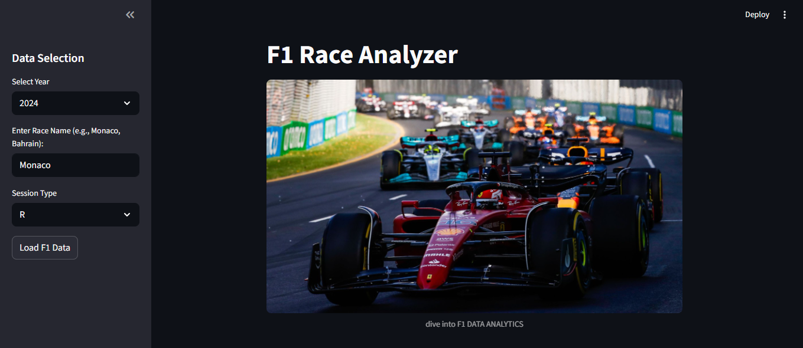
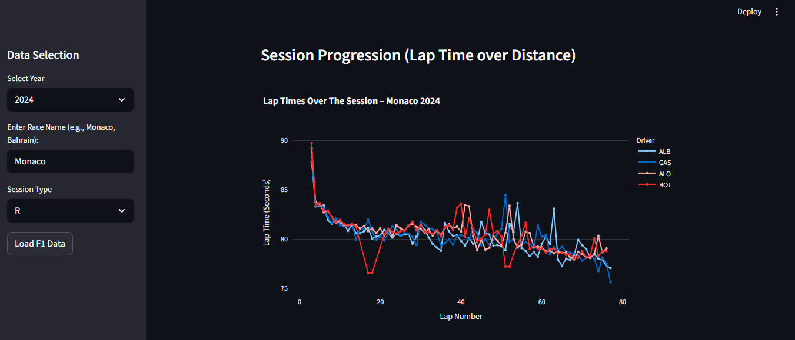
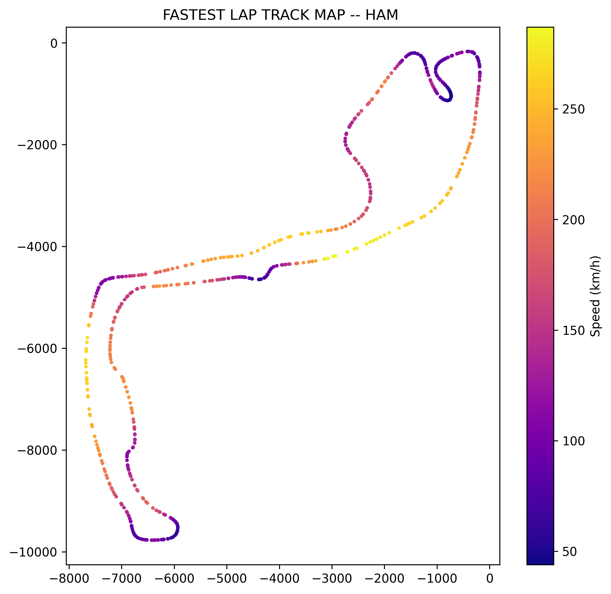

#  F1 Race Analyzer

An interactive Formula 1 data visualization web app built using **Streamlit** and **FastF1**.  
This project lets users analyze real F1 session data, compare driver performances, visualize telemetry, and explore race insights.

---

##  Features

- Fetches live session data using the **FastF1** API.
- Displays **Lap Time Distribution** (Box Plot).
- Shows **Session Progression** (Lap Time vs Lap Number).
- Enables **Telemetry Comparison** between two drivers on their fastest laps.
- Interactive sidebar for selecting **Year**, **Race**, and **Session Type**.
- Dynamic **driver selection** and real-time data filtering.
- Caching enabled for faster reloading.

---
##  Sample Visualizations

Below are a few examples of the interactive visuals and telemetry outputs from the **F1 Race Analyzer** app.

---

###  App Interface 
This view shows the sample interface of the app.



---

###  App Interface — Session Progression
This visualization shows how each driver’s lap times evolve across the session.



---

###  Telemetry Analysis
Compares driver telemetry traces — such as speed or throttle — over distance on their fastest laps.



##  Project Structure

```
.
├── app.ipynb                # Jupyter notebook for prototype or testing
├── f1_app.py                # Main Streamlit app
├── cache1/                  # Cached session data (auto-created)
└── images/                  # Optional folder for images (referenced in app)
```

---

##  Installation

1. **Clone the repository**

   ```bash
   git clone https://github.com/Azmi-khan/F1_data_visualisation.git
   cd F1_data_visualisation
   ```

2. **Create a virtual environment (optional)**

   ```bash
   python -m venv venv
   source venv/bin/activate  # macOS/Linux
   venv\Scripts\activate   # Windows
   ```

3. **Install dependencies**

   ```bash
   pip install streamlit fastf1 pandas plotly matplotlib
   ```

---

## 🚀 Usage

1. Run the Streamlit app:

   ```bash
   streamlit run f1_app.py
   ```

2. In the web interface:

   - Choose **Year** (e.g., 2024, 2023, 2022)
   - Enter a **Race Name** (e.g., `Monaco`, `Bahrain`)
   - Select a **Session Type** (R, Q, FP1, S)
   - Click **"Load F1 Data"**
   - Explore the analysis tabs:  
     -  *Lap Time Distribution*  
     -  *Session Progression*  
     - ⚙ *Telemetry Comparison*

---

##  Data Caching

FastF1 automatically caches session data inside the `cache1/` folder to speed up future loads.  
You can delete this folder anytime to refresh the cache.

---

##  Notes

- Ensure your internet connection is stable — FastF1 downloads live session data.  
- Not all sessions may have telemetry data (especially older races).  
- If telemetry fails, try selecting another driver or race.

---

##  Dependencies

- Python 3.8+  
- Streamlit  
- FastF1  
- Plotly  
- Matplotlib  
- Pandas

---

##  License

MIT License © 2025 [Azmi Khan]

Feel free to fork, modify, and contribute!

---

##  Contact

For any issues or suggestions:  
**GitHub:** [Azmi-khan](https://github.com/Azmi-khan)  

---

> “Racing is life. Everything before or after is just waiting.” – Steve McQueen
